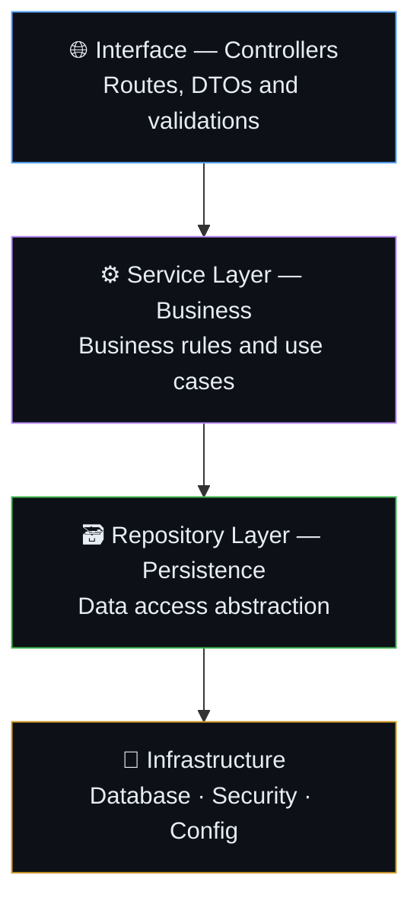

<div align="center">


> REST API for medication distribution management with strict sector-based access control (RBAC), transactional order flow, and inventory traceability.


[](./LICENSE)
[](https://openjdk.org/)
[](https://github.com/MonteirDev/GESMED/commits/main)

</div>

---

##  Table of Contents

- [About](#-about)
- [Features](#-features)
- [Architecture](#-architecture)
- [Tech Stack](#-tech-stack)
- [Prerequisites](#-prerequisites)
- [Installation and setup](#-installation-and-setup)
- [Configuration](#-configuration)
- [API Endpoints](#-api-endpoints)
- [Tests](#-tests)
- [Project structure](#-project-structure)
- [Technical decisions](#-technical-decisions)
- [Roadmap](#-roadmap)
- [Learnings](#-learnings)
- [License](#-license)

---

##  About

<!-- 2-4 paragraphs. Answer: What is it? Why was it created? Who would use it? What makes it different? -->

This project emerged from the reconstruction of a legacy system written in plain PHP that a colleague developed at work. The challenge was to recreate the same system in Java with a reduced scope — focused on demonstrating in practice concepts such as JWT authentication, sector-based access control (RBAC), and layered architecture.

**Target audience:** technical recruiters, developers who want to understand the topic, and myself as a future reference.

---

##  Features


- [x] Stateless authentication with JWT and sector-based access control (RBAC)
- [x] Manufacturers and Products CRUD with validations
- [x] Unit tests per layer (Repository, Service, Controller)
- [x] Schema versioning with Flyway
- [ ] Customer registration and delivery addresses *(in development)*
- [ ] Contract management with per-product balance control *(planned)*
- [ ] Transactional order flow with state machine *(planned)*
- [ ] Inventory control by batch and expiration date *(planned)*

---

##  Architecture

The project was structured following the principles of Layered Architecture. This approach ensures separation of concerns, making it easier to maintain, test components in isolation, and scale the system.



**Main flow:**
1. Request arrives at the **Controller** → validates input via DTO
2. Controller calls the **Service** → applies business rule
3. Service calls the **Repository** → persists or queries data
4. Response returns through the same path as a **ResponseDTO**

---

##  Tech Stack

| Layer | Technology | Reason for choice |
|--------|-----------|-------------------|
| Language | Java 21 | Static typing, enterprise market maturity and Spring ecosystem |
| Framework | Spring Boot 4 | Robust structure for REST APIs with conventions that guide best practices |
| Security | Spring Security + JWT | Stateless authentication with role-based access control (RBAC) |
| Database | PostgreSQL | ACID, UUID support, complex relational queries for the contract flow |
| Database (dev) | H2 | In-memory database for local testing without external dependencies |
| ORM | Spring Data JPA + Hibernate | Database abstraction with support for auditing and complex relationships |
| Migration | Flyway | Schema versioning with traceable history per SQL file |
| Tests | JUnit 5 + Mockito | Native to the Spring ecosystem, supports isolated per-layer testing |
| Build | Maven | Dependency management and standard build lifecycle for the Java ecosystem | |

---

##  Prerequisites

Before you begin, make sure you have installed:

- **Java JDK 21** — Required to compile and run the project. OpenJDK is recommended.
<!-- - **Docker** — `>= 24.x` → [how to install](https://docs.docker.com/get-docker/)
- **Docker Compose** — `>= 2.x` → included in Docker Desktop -->
<!-- - **GNU Make** — to use the `Makefile` shortcuts *(optional, but recommended)* -->

---

##  Installation and setup

<!-- ### Option 1 — Docker Compose *(recommended)*

Starts everything (app + dependencies) with a single command:

```bash
# Clone the repository
git clone https://github.com/seu-usuario/nome-do-repo.git
cd nome-do-repo

# Copy and adjust environment variables
cp .env.example .env

# Start all services
docker compose up -d

# Follow the logs (optional)
docker compose logs -f app
```

The API will be available at: `http://localhost:8080`
Swagger documentation: `http://localhost:8080/docs`

--- -->

### Local setup

```bash
# Clone and enter the project
git clone https://github.com/MonteirDev/GESMED.git
cd gesmed

# Install dependencies and compile the project
./mvnw install -DskipTests

# Run the application
./mvnw spring-boot:run
```

> Flyway migrations are executed automatically when the application starts.

---

### Useful commands

```bash
./mvnw spring-boot:run          # Runs the application
./mvnw test                     # Runs all tests
./mvnw test -Dtest=*Repository* # Repository tests only
./mvnw test -Dtest=*Service*    # Service tests only
./mvnw test -Dtest=*Controller* # Controller tests only
./mvnw install -DskipTests      # Compiles without running tests
```

---

##  Configuration

Variables are defined in `application.properties`. For production, use environment variables.

### Available variables

| Variable | Description | Default | Required |
|----------|-----------|--------|-------------|
| `spring.datasource.url` | Database connection URL | `jdbc:h2:mem` | YES |
| `spring.datasource.username` | Database user | `sa` | YES |
| `spring.datasource.password` | Database password | — | YES |
| `spring.jpa.hibernate.ddl-auto` | JPA schema strategy | `validate` | YES |
| `spring.flyway.enabled` | Enables Flyway migration | `true` | YES |
| `jwt.secret` | Secret key for JWT signing | — | YES |
| `jwt.expiration` | Token expiration time in ms | `86400000` | YES |

> ️**Never commit real credentials in `application.properties`.** Use environment variables in production: `${JWT_SECRET}`, `${DB_PASSWORD}`.

##  API Endpoints

> The API follows the REST standard with authentication via `Authorization: Bearer <token>`.

```
[Public]
POST   /auth/register       Creates a new user
POST   /auth/login          Authenticates and returns the JWT token

[Manufacturer] — requires Authorization: Bearer <token>
GET    /manufacturer        Lists all manufacturers
GET    /manufacturer/{id}   Finds manufacturer by ID
POST   /manufacturer        Registers a new manufacturer
PUT    /manufacturer/{id}   Updates manufacturer
DELETE /manufacturer/{id}   Removes manufacturer

[Product] — requires Authorization: Bearer <token>
GET    /product/{id}        Finds product by ID
POST   /product             Registers a new product
PUT    /product/{id}        Updates product
```

### Request/response example

```bash
# Login
curl -X POST http://localhost:8080/auth/login \
  -H "Content-Type: application/json" \
  -d '{"username": "financeiro", "password": "senha123"}'

# Response 200 OK
{
  "token": "eyJhbGci..."
}

# Using the token on a protected route
curl http://localhost:8080/manufacturer \
  -H "Authorization: Bearer eyJhbGci..."

# Response 200 OK
[
  {
    "id": "uuid",
    "name": "CIMED",
    "cnpj": "12345678000100",
    "active": true
  }
]
```

---

##  Tests

```bash
# All tests
./mvnw test

# Tests for a specific layer
./mvnw test -Dtest=ManufacturerRepositoryTest
./mvnw test -Dtest=ManufacturerServiceTest
./mvnw test -Dtest=ManufacturerControllerTest
```

### Testing strategy

| Type | Tool | Description |
|------|-----------|-----------|
| Repository | `@DataJpaTest` + H2 | Tests queries and persistence with an in-memory database |
| Service | `@ExtendWith(MockitoExtension.class)` | Tests business rules with mocked dependencies |
| Controller | `@WebMvcTest` + MockMvc | Tests endpoints, HTTP status codes and JSON serialization |

---

##  Project structure

```
gesmed/
├── src/
│   ├── main/
│   │   ├── java/com/gyanMonteiro/gesmed/
│   │   │   ├── config/security/     # Spring Security, JWT and filters
│   │   │   ├── controller/          # REST endpoints
│   │   │   ├── dto/                 # Request and Response DTOs
│   │   │   ├── entity/              # JPA entities
│   │   │   ├── enums/               # Enums (Role, OrderStatus...)
│   │   │   ├── exceptions/          # Custom exceptions
│   │   │   ├── handler/             # GlobalExceptionHandler
│   │   │   ├── mapper/              # Entity ↔ DTO conversion
│   │   │   ├── repository/          # JPA interfaces
│   │   │   ├── service/             # Business rules
│   │   │   └── GesmedApplication.java
│   │   └── resources/
│   │       ├── db/migration/        # Flyway scripts (V1__, V2__...)
│   │       └── application.properties
│   └── test/
│       ├── java/com/gyanMonteiro/gesmed/
│       │   ├── controller/          # Controller tests (@WebMvcTest)
│       │   ├── repository/          # Repository tests (@DataJpaTest)
│       │   └── service/             # Service tests (Mockito)
│       └── resources/
│           └── application-test.properties
├── .gitignore
├── LICENSE
├── mvnw
├── pom.xml
└── README.md
```

---

##  Technical decisions

<!-- This section is a huge differentiator in portfolios. Show that you think beyond the code. -->

### Why Java and not PHP?

**Context:** GESMED emerged as the reconstruction of a legacy system in plain PHP, with a reduced scope and a focus on learning modern backend development.

**Alternatives considered:** keeping PHP with Laravel, migrating to Node.js with NestJS.

**Decision:** I chose Java with Spring Boot because the ecosystem offers a robust structure for learning layered architecture, RBAC, transactions and best practices in a natural way — the framework guides the right decisions. Furthermore, Java is widely required in the enterprise market.

**Accepted trade-offs:** steeper learning curve at the beginning, more verbosity compared to PHP. Offset by the gains in organization, type safety and the maturity of the Spring ecosystem.

---

### Why Layered Architecture?

**Context:** solo project with a complex business domain — multiple sectors, transactional order flow and role-based access control. Expected growth throughout the development phases.

**Decision:** I adopted Layered Architecture with the `Entity → Repository → DTO → Mapper → Service → Controller` pattern because it clearly separates responsibilities, facilitates isolated testing of each layer, and is the most widely adopted pattern in the Spring ecosystem. For a solo portfolio project, I avoided over-engineering — the architecture is simple enough to be maintained by one person, but organized enough to scale if necessary.

**Accepted trade-offs:** more files and classes compared to a procedural approach. Offset by ease of maintenance and testability.

---

##  Roadmap

- [x] Phase 1 — Manufacturers and Products CRUD with per-layer tests
- [x] Phase 2 — Spring Security + JWT + Customer and Address registration
- [ ] Phase 2.1 — Customer and address registration *(in development)*
- [ ] Phase 3 — Contract management with per-product balance control
- [ ] Phase 4 — Transactional order flow with state machine
- [ ] Phase 5 — Inventory control by batch, expiration date and logical reservation

---

##  Learnings

Key learnings and challenges encountered in this project:

- **Layered architecture:** I learned in practice how to separate responsibilities between Controller, Service, Repository and Mapper — and why that separation makes maintenance and isolated testing easier.

- **Per-layer testing:** I understood that each layer has its own tool — `@DataJpaTest` for Repository, Mockito for Service and `@WebMvcTest` for Controller. The biggest challenge was realizing that Repository tests don't use the Mapper, and that entities with FK must be persisted in the correct order.

- **Spring Security + JWT:** I had difficulty understanding the complete stateless authentication flow — from the `JwtAuthFilter` filter to the registration in `SecurityContextHolder`. The solution came from studying the material provided by my professor, along with a video by [Fernanda Kipper](https://www.youtube.com/watch?v=5w-YCcOjPD0&t) and adapting it to the GESMED reality with multiple roles per sector.

- **Business-oriented relational modeling:** I learned to make schema decisions based on real business rules — such as separating `contract_items` from `contract` to control balance per product.
---

##  License

Distributed under the **MIT** license. See [`LICENSE`](./LICENSE) for more details.

---

<div align="center">

Made  by **[Gyan Monteiro](https://github.com/MonteirDev)**

[](https://www.linkedin.com/in/gyanmonteiro/)
<!-- [](https://seu-site.dev) -->

</div>